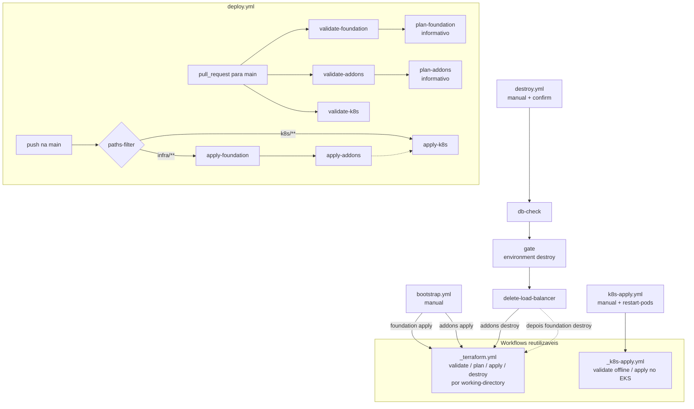

# Pipelines (GitHub Actions)

As pipelines deste repositório cuidam de dois roots do Terraform, [infra/foundation](../../infra/foundation) e [infra/addons](../../infra/addons), e dos manifests em [k8s/](../../k8s). A lógica técnica fica em dois **workflows reutilizáveis**:
- `_terraform.yml`
- `_k8s-apply.yml`

Os quatro workflows de entrada decidem só **quando** chamar cada um e com quais inputs:
- `bootstrap.yml`
- `deploy.yml`
- `k8s-apply.yml`
- `destroy.yml`

Build e push das imagens no ECR **não** ficam aqui: são do repositório APP.

## Visão geral



> Convenção: workflows que começam com `_` são internos, chamados com `uses: ./.github/workflows/_x.yml`.

## Arquivos

```
.github/workflows/
  _terraform.yml   (workflow_call)       - validate | plan | apply | destroy em infra/foundation ou infra/addons
  _k8s-apply.yml   (workflow_call)       - validate (kustomize offline) | apply (kubectl apply -k k8s)
  bootstrap.yml    (workflow_dispatch)   - foundation → addons
  deploy.yml       (pull_request, push)  - checks de PR; apply no merge conforme o que mudou
  k8s-apply.yml    (workflow_dispatch)   - apply dos manifests, com restart opcional
  destroy.yml      (workflow_dispatch)   - addons → foundation, com confirmação e aprovação
```

---

## 1. `_terraform.yml` (reusable)

Inputs:
- `working-directory`: `infra/foundation` ou `infra/addons`.
- `command`: `validate`, `plan`, `apply` ou `destroy`.

O workflow tem um único job, `terraform`.

| Step | validate | plan | apply / destroy |
|---|---|---|---|
| Bloqueio fora da `main` (falha com erro) | — | — | ✔ se `github.ref != refs/heads/main` |
| `actions/checkout@v7` | ✔ | ✔ | ✔ |
| `aws-actions/configure-aws-credentials@v6` | — | ✔ | ✔ |
| `hashicorp/setup-terraform@v4` (Terraform `1.15.8`, sem wrapper) | ✔ | ✔ | ✔ |
| `terraform init -input=false` | com `-backend=false` | ✔ | ✔ |
| `terraform fmt -check -recursive` | ✔ | ✔ | ✔ |
| `terraform validate` | ✔ | ✔ | ✔ |
| `terraform plan -input=false -lock=false` | — | ✔ | — |
| `terraform <cmd> -auto-approve -input=false -lock-timeout=15m` | — | — | ✔ |

- **Sem variáveis sensíveis:** nenhum dos dois roots tem variável sensível. O CI usa só os defaults de `variables.tf` e as credenciais AWS, sem `terraform.tfvars` e sem `TF_VAR_*`.
- **Versões fixas:** Terraform `1.15.8`. Os providers ficam fixados pelos `.terraform.lock.hcl` versionados em cada root.
- **Plan sem lock:** o plan do PR é especulativo e não grava state. Por isso não disputa lock com um apply e não deixa lock órfão se for cancelado.
- **Plan do addons:** o provider Helm e o data source `aws_eks_cluster` precisam do cluster de pé. Sem o cluster, esse plan falha, e por isso ele é só informativo.
- **Concorrência** (definida só no reusable):
  - `apply` e `destroy` usam um grupo fixo **por root** (`terraform-infra/foundation`, `terraform-infra/addons`), com `cancel-in-progress: false`.
  - `validate` e `plan` usam um grupo por root, comando e ref, com `cancel-in-progress: true`.
  - No padrão do GitHub (`queue: single`), cada grupo mantém no máximo um run pendente, e um run novo substitui o pendente anterior.

## 2. `_k8s-apply.yml` (reusable)

Inputs:
- `command`: `validate` ou `apply`.
- `restart-pods`: boolean, padrão `false`.

O workflow tem um único job, `kubectl`.

| Step | validate | apply |
|---|---|---|
| Bloqueio fora da `main` (falha com erro) | — | ✔ |
| `actions/checkout@v7`: commit do run no validate; **ponta da `main`** no apply, para um run antigo não sobrescrever manifests mais novos | ✔ | ✔ |
| `azure/setup-kubectl@v5` | ✔ | ✔ |
| Conferir se as secrets e variables estão configuradas (falha se alguma estiver vazia) | — | ✔ |
| `cp k8s/.env.example k8s/.env` + `kubectl kustomize k8s` (offline) | ✔ | — |
| Credenciais AWS + `aws eks update-kubeconfig` | — | ✔ |
| Descobrir o endpoint do RDS (`aws rds describe-db-instances`, pelo identifier do repo DB) | — | ✔ **falha** se não houver endpoint |
| Gerar `k8s/.env`: `DatabaseSettings__ConnectionString` e `ResendSettings__ApiKey` | — | ✔ |
| `kubectl apply -k k8s` | — | ✔ |
| `kubectl rollout restart deployment -n oficina -l app.kubernetes.io/part-of=techchallenge-oficina` | — | se `restart-pods` |

- **Secret sem hash no nome:** o `k8s/.env` só existe no runner, e o Kustomize (`secretGenerator`) gera o Secret `oficina-api-secrets` a partir dele. Como o Secret usa `disableNameSuffixHash`, alterá-lo **não** reinicia os pods; para isso existe o `restart-pods`.
- **Segredos por variável de ambiente:** os segredos entram no step de geração como variáveis de ambiente (`$env:RDS_PASSWORD`), sem interpolação `${{ }}` dentro do script PowerShell. Assim, `$` e backtick na senha não são interpretados.
- **Concorrência:**
  - `apply` usa o grupo fixo `k8s-apply` (`cancel-in-progress: false`).
  - `validate` usa um grupo por ref (`cancel-in-progress: true`).

## 3. `bootstrap.yml`

- **Gatilho:** `workflow_dispatch`.
- **Jobs:** `terraform-foundation` (apply) → `terraform-addons` (apply).

Use-o na primeira criação, para recriar depois de um Destroy e para reaplicar a HEAD da `main` sem precisar de um push. Um push em `infra/**` também cria o ambiente do zero se ele estiver desligado, porque a foundation não depende de nada existente. Veja o aviso de custo no [README principal](../../README.md#5-pipelines-github-actions).

Ele **não** aplica os manifests. A ordem completa entre repositórios está no [README principal](../../README.md#2-dependências-entre-repositórios): K8S Bootstrap → DB Bootstrap → APP (imagens) → **K8s Apply**.

## 4. `deploy.yml`

É a pipeline de alteração. Os jobs são condicionados pelo evento (`github.event_name`):

| Evento | Job | Chama | Observação |
|---|---|---|---|
| `pull_request` → `main` (sem filtro de paths) | `validate-foundation` | `_terraform.yml` validate | **Check obrigatório** `validate-foundation / terraform`, sem AWS |
| | `validate-addons` | `_terraform.yml` validate | **Check obrigatório** `validate-addons / terraform`, sem AWS |
| | `validate-k8s` | `_k8s-apply.yml` validate | **Check obrigatório** `validate-k8s / kubectl`, sem AWS |
| | `plan-foundation` (`needs: validate-foundation`) | `_terraform.yml` plan | Informativo. Pulado em PR de fork (sem secrets) |
| | `plan-addons` (`needs: validate-addons`) | `_terraform.yml` plan | Informativo. Exige o cluster de pé. Pulado em PR de fork |
| `push` na `main` | `changes` | `dorny/paths-filter@v4` | Separa `infra` (`infra/**`, `_terraform.yml`, `deploy.yml`) de `k8s` (`k8s/**`, `_k8s-apply.yml`) |
| | `apply-foundation` → `apply-addons` | `_terraform.yml` apply | Se `infra` mudou |
| | `apply-k8s` | `_k8s-apply.yml` apply **com restart** (`restart-pods: true`) | Se `k8s` mudou. Espera a infra quando as duas mudam (`!failure() && !cancelled()`) |

- **PR sem filtro de paths:** o `pull_request` não usa filtro de paths de propósito. Se usasse, os checks obrigatórios ficariam *pending* em PRs que só mexem em documentação.
- **Não use "Re-run" em um Deploy antigo para infra:** ele reaplica o `github.sha` daquele run. Para aplicar a HEAD da infra, use o Bootstrap. O apply dos manifests sempre usa a ponta da `main`, então o re-run dele é seguro.

## 5. `k8s-apply.yml`

- **Gatilho:** `workflow_dispatch`, com o input `restart-pods` (padrão `true`).
- **Job:** `apply` → `_k8s-apply.yml` com `command: apply`.

O repo [APP](https://github.com/GuiToniello/tech-challenge-fase-3-APP-soat16-rm374658) dispara este workflow automaticamente, com `restart-pods = true`, depois de publicar imagens no ECR. Ele usa `gh workflow run` com um token *fine-grained* que tem **Actions: Read and write** neste repositório. Esse token fica no secret `K8S_REPO_TOKEN` do APP. Nada precisa ser configurado aqui.

Rode manualmente no primeiro deploy dos manifests, se as imagens já estiverem no ECR. Rode também, com `restart-pods = true`, nestes casos:
- imagem nova no ECR, se o dispatch do APP não tiver rodado;
- troca de `RDS_PASSWORD` ou `RESEND_API_KEY`;
- RDS recriado;
- Qualquer mudança que precise reiniciar os pods sem ter passado pelo Deploy. O Deploy de push em `k8s/**` já aplica **com** restart, porque ConfigMaps e Secret não têm hash no nome e esse run pode substituir, na fila, um K8s Apply pendente disparado pelo APP.

Mudanças no spec do Deployment (imagem, recursos, probes) já fazem rollout sozinhas.

## 6. `destroy.yml`

- **Gatilho:** `workflow_dispatch` com o input obrigatório `confirm`. A comparação do GitHub não diferencia maiúsculas.

| Job | Quando roda | O que faz |
|---|---|---|
| `reject` | `confirm` ≠ `destroy` ou branch ≠ `main` | **Falha** com erro, em vez de terminar verde sem ter destruído nada |
| `db-check` | `confirm` = `destroy` na `main` | **Falha** em três casos: a var `RDS_INSTANCE_IDENTIFIER` está vazia, o RDS ainda existe, ou o SG `techchallenge-oficina-rds-sg` ainda existe. Assim o destroy não remove os addons para depois travar no `DependencyViolation` da rede |
| `gate` | depois do `db-check` | `environment: destroy`: aprovação manual. É um job à parte porque um job com `uses:` não aceita `environment` |
| `delete-load-balancer` | depois do `gate` | Se o cluster existir, roda `kubectl delete service ingress-nginx-controller -n ingress-nginx --wait`. O finalizer do Service só libera depois que o ELB (criado pelo Kubernetes, não pelo Terraform) é removido, o que evita ELB órfão e VPC travada |
| `terraform-destroy-addons` → `terraform-destroy-foundation` | depois do `delete-load-balancer` | `_terraform.yml` destroy |

Configure o environment `destroy` **antes** do primeiro uso, com *Required reviewers* e *Deployment branches* restrito a `main`. Se ele não existir, o GitHub o cria sem proteção.

**Não dispare o Destroy com Deploy, Bootstrap ou K8s Apply em andamento.** Os jobs de destroy dividem os grupos de concorrência com os applies, e um run novo pode substituir um destroy pendente. Se o Destroy terminar *cancelled* ou falhar depois do `delete-load-balancer`, rode-o de novo. Para desistir e restaurar o LB do ingress, use `terraform apply -replace=helm_release.ingress_nginx` em `infra/addons`. O Bootstrap sozinho não recria o Service.

---

## Secrets e Variables

Configure em **Settings → Secrets and variables → Actions**:

| Nome | Tipo | Usado por |
|---|---|---|
| `AWS_ACCESS_KEY_ID` / `AWS_SECRET_ACCESS_KEY` | Secret | Todos os jobs que acessam a AWS (usuário IAM `terraform`) |
| `RDS_PASSWORD` | Secret | `_k8s-apply.yml`: connection string. Igual à do repo DB |
| `RESEND_API_KEY` | Secret | `_k8s-apply.yml` |
| `AWS_REGION` | Variable | Todos (`us-east-1`) |
| `EKS_CLUSTER_NAME` | Variable | `_k8s-apply.yml` e `destroy.yml` (`techchallenge-oficina-eks`) |
| `RDS_INSTANCE_IDENTIFIER` | Variable | `_k8s-apply.yml` e `destroy.yml` (`techchallenge-oficina-postgres`) |
| `RDS_DATABASE` / `RDS_USERNAME` | Variable | `_k8s-apply.yml` (`oficina` / `sa`) |

Todos os callers usam `secrets: inherit`, e todos os workflows declaram `permissions: contents: read`.
