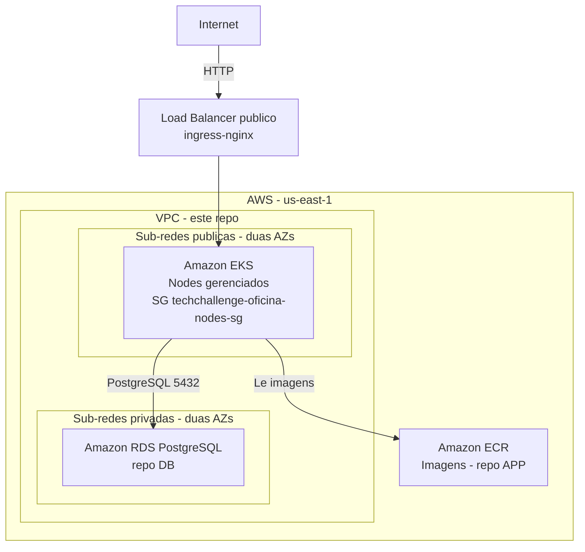

# tech-challenge-fase-3-K8S-soat16-rm374658

Infraestrutura de rede e Kubernetes do projeto **Tech Challenge Oficina** (SOAT16, fase 3). O Terraform deste repositório cria na AWS a VPC, o Amazon EKS e os addons do cluster. Os manifests Kubernetes das cinco APIs também ficam aqui, e tudo é mantido por pipelines próprias no GitHub Actions.

O repositório não usa código nem state de outro repositório: tem os próprios Terraform states, a própria configuração e os próprios workflows. Ele se relaciona com outros três repositórios:
- **[DB](https://github.com/GuiToniello/tech-challenge-fase-3-DB-soat16-rm374658)**: cria o Amazon RDS dentro da rede deste repositório.
- **[APP](https://github.com/GuiToniello/tech-challenge-fase-3-APP-soat16-rm374658)**: builda e publica as imagens no Amazon ECR.
- **LAMBDA**.

## 1. O que é provisionado

Tudo fica na AWS, região `us-east-1`, em duas configurações Terraform independentes:

| Configuração | State | Recursos |
|---|---|---|
| [infra/foundation](infra/foundation) | `techchallenge-oficina/k8s-foundation.tfstate` | VPC `10.0.0.0/16`, subnets públicas e privadas (2 AZs), Internet Gateway e rotas, SGs do cluster e dos nodes, IAM roles, EKS `techchallenge-oficina-eks` (1.32), node group `t3.small` (2/2/2) e access entries |
| [infra/addons](infra/addons) | `techchallenge-oficina/k8s-addons.tfstate` | `ingress-nginx` (Load Balancer público) e Metrics Server, via Helm |

Os manifests em [k8s/](k8s) criam o namespace `oficina` e, para cada uma das cinco APIs (monolith, approval, createos, getos, status), um ConfigMap, um Deployment, um Service e um HPA. Também criam o Ingress `oficina-apis` e o Secret `oficina-api-secrets`.



As subnets privadas não têm NAT nem rota para a Internet. Elas existem para o banco do repositório DB. Os detalhes da arquitetura estão em [infra/ESTRUTURA.md](infra/ESTRUTURA.md), e o passo a passo local em [infra/README.md](infra/README.md). A organização dos manifests está em [k8s/README.md](k8s/README.md).

## 2. Dependências entre repositórios

### Ordem

| Operação | Ordem |
|---|---|
| Deploy | **K8S** Bootstrap (rede + EKS + addons) → **DB** Bootstrap (RDS) → **APP** (imagens no ECR) / **LAMBDA** → **K8S** K8s Apply (manifests) |
| Destroy | **APP** / **LAMBDA** → **DB** → **K8S** |

- O Bootstrap deste repositório **não** aplica os manifests. Os pods precisam do RDS, para montar a connection string, e das imagens no ECR. Por isso o apply dos manifests é o workflow separado **K8s Apply**, que roda por último.
- O Destroy deste repositório **falha** se o RDS ainda existir. O RDS usa as subnets privadas, e o SG dele referencia o SG dos nodes, então apagar a rede antes travaria em `DependencyViolation`.

### Contrato produzido (usado pelo repo DB)

O repositório DB encontra a rede por tag e nome, sem ler o state deste repositório. **Estes nomes não podem mudar:**

| Item | Valor |
|---|---|
| VPC | Tag `Project = techchallenge-oficina`, aplicada pelo `default_tags` do provider em [providers.tf](infra/foundation/providers.tf). Precisa existir **uma única** VPC com essa tag |
| Subnets privadas | `techchallenge-oficina-private-1` e `-2`, em duas AZs ([vpc.tf](infra/foundation/vpc.tf)) |
| SG dos nodes | `techchallenge-oficina-nodes-sg`, anexado aos worker nodes pelo launch template ([eks-node-groups.tf](infra/foundation/eks-node-groups.tf)) |

O nome do cluster (`techchallenge-oficina-eks`) é usado só por este repositório: pelos addons e pela variable `EKS_CLUSTER_NAME`.

### Contrato consumido

| De | Item | Uso |
|---|---|---|
| DB | Identifier `techchallenge-oficina-postgres`, database `oficina`, usuário `sa`, porta `5432`, senha no secret `RDS_PASSWORD` | O K8s Apply descobre o endpoint e monta `DatabaseSettings__ConnectionString` no Secret das APIs |
| DB | SG `techchallenge-oficina-rds-sg` e o identifier do RDS | O Destroy (`db-check`) confere que os dois já foram removidos antes de destruir a rede |
| APP | Imagens `903936907231.dkr.ecr.us-east-1.amazonaws.com/techchallenge-oficina-<api>:latest`. Os 5 repositórios ECR já existem e não são gerenciados por este Terraform | Deployments com `imagePullPolicy: Always`. O pull usa a role IAM dos nodes (`AmazonEC2ContainerRegistryReadOnly`) |

## 3. Pré-requisitos (manuais, uma vez)

0. **Ambiente da fase 2 destruído.** Este repositório cria recursos com os mesmos nomes da fase 2 (EKS, IAM roles, VPC com tag `Project`), mas usa states novos (`k8s-*.tfstate`). Se a fase 2 ainda existir, o Bootstrap falha com nomes duplicados, e o repositório DB passa a encontrar duas VPCs. Desative também os workflows do repositório da fase 2, para que nada seja recriado por engano.
1. **Bucket S3 `terraform-state-soat16`** em `us-east-1`, com versionamento, criptografia e bloqueio de acesso público. É compartilhado entre os repositórios, cada um com as próprias keys. Este usa `techchallenge-oficina/k8s-foundation.tfstate` e `techchallenge-oficina/k8s-addons.tfstate`, com lock nativo (`use_lockfile`).
2. **Usuário IAM `terraform`**: suas access keys vão nos secrets do GitHub. Ele recebe uma access entry de administrador no EKS (`aws_caller_identity`). **Use sempre o mesmo usuário**, no CI e localmente. Com outro usuário, a access entry é substituída, e o usuário anterior perde o acesso ao cluster. Permissões necessárias, em linhas gerais:
   - `eks:*` no cluster, node group, access entries e access policies.
   - EC2: VPC, subnets, route tables, Internet Gateway, security groups, launch templates, tags e `ec2:Describe*`.
   - IAM:
     - `iam:CreateRole`, `iam:DeleteRole`, `iam:GetRole`, `iam:TagRole`, `iam:PassRole`.
     - `iam:AttachRolePolicy`, `iam:DetachRolePolicy`, `iam:ListAttachedRolePolicies`, `iam:ListRolePolicies`, `iam:ListInstanceProfilesForRole`.
     - `iam:GetUser` (para `cluster_admin`) e `iam:CreateServiceLinkedRole` (EKS, node group e ELB).
   - `rds:DescribeDBInstances` (K8s Apply e Destroy) e `elasticloadbalancing:Describe*`.
   - S3: `s3:GetObject`, `s3:PutObject` e `s3:DeleteObject` em `techchallenge-oficina/k8s-*.tfstate*`, mais `s3:ListBucket` no bucket.
3. **Usuário IAM `cluster_admin`**: acesso alternativo ao cluster. É **obrigatório**: a foundation consulta esse usuário (`data "aws_iam_user"`), e o plan falha se ele não existir.
4. **Secrets e Variables do GitHub**: veja a seção 4.
5. **Environment `destroy`** (Settings → Environments): crie **antes** do primeiro Destroy, com você como *Required reviewer* e *Deployment branches* restrito a `main`. Não dispare o Destroy com um Deploy ou Bootstrap em andamento (veja o Troubleshooting).
6. **Proteção da branch `main`** (Settings → Branches): exija Pull Request e os status checks abaixo. Eles só aparecem na lista depois que o primeiro PR roda a pipeline.
   - `validate-foundation / terraform`
   - `validate-addons / terraform`
   - `validate-k8s / kubectl`

## 4. Secrets e Variables

| Nome | Tipo | Uso |
|---|---|---|
| `AWS_ACCESS_KEY_ID` | Secret | Credencial do usuário IAM `terraform` |
| `AWS_SECRET_ACCESS_KEY` | Secret | Idem |
| `RDS_PASSWORD` | Secret | Senha do RDS para a connection string. Deve ser **igual** à do repo DB |
| `RESEND_API_KEY` | Secret | Chave da API de e-mail (Resend) das APIs |
| `AWS_REGION` | Variable | `us-east-1` |
| `EKS_CLUSTER_NAME` | Variable | `techchallenge-oficina-eks` |
| `RDS_INSTANCE_IDENTIFIER` | Variable | `techchallenge-oficina-postgres` (contrato do repo DB) |
| `RDS_DATABASE` | Variable | `oficina` |
| `RDS_USERNAME` | Variable | `sa` |

Os segredos são passados ao `k8s/.env` por variáveis de ambiente, sem interpolação no script. Por isso `$` e backtick na senha não são interpretados. O `;` continua proibido, porque quebra a connection string.

## 5. Pipelines (GitHub Actions)

| Workflow | Gatilho | O que faz |
|---|---|---|
| **Bootstrap** | Manual | `apply` da foundation → `apply` dos addons. Não aplica manifests |
| **Deploy** | Pull Request para `main` | `validate` offline de foundation, addons e manifests (checks obrigatórios) → `plan` informativo de foundation e addons |
| **Deploy** | Push na `main` | Mudança em `infra/**`, `deploy.yml` ou `_terraform.yml`: apply foundation → addons. Mudança em `k8s/**` ou `_k8s-apply.yml`: apply dos manifests (sem restart) |
| **K8s Apply** | Manual (input `restart-pods`, padrão `true`) | Descobre o RDS, gera o Secret, `kubectl apply -k k8s` e, opcionalmente, `rollout restart` |
| **Destroy** | Manual, `confirm = destroy` + aprovação | Confere que o RDS e o SG dele já foram destruídos → remove o Service LoadBalancer do ingress (e espera o ELB sair) → destroy dos addons → destroy da foundation |

Apply, K8s Apply e Destroy só rodam a partir da `main`. Disparados em outra branch, **falham** com erro. Os detalhes estão em [.github/workflows/README.md](.github/workflows/README.md).

**Atenção ao custo: um merge em `infra/**` com o ambiente desligado recria o ambiente.** A foundation não depende de nada existente, então o push na `main` aplica a foundation e os addons do zero, subindo VPC, EKS, nodes e Load Balancer. Isso inclui o **primeiro push** deste código. Como na fase 2, é o comportamento esperado; tenha isso em mente:
- **Com a infra destruída:**
  - O `plan-foundation` do PR mostra a criação completa.
  - Só o `plan-addons` falha, porque não há cluster.
  - Os `validate` continuam verdes.
- **Não faça merge de mudanças em `infra/**`, `deploy.yml` ou `_terraform.yml` enquanto quiser o ambiente desligado.** Se o merge acontecer, destrua de novo com o Destroy.
- **Primeiro push:**
  - Cria a infra e depois falha no `apply-k8s`, porque o RDS do repo DB ainda não existe. Isso é esperado.
  - Siga a ordem da seção 2: DB Bootstrap → imagens do APP → **K8s Apply**.
  - Se ainda não quiser subir nada, faça o primeiro push **antes** de configurar os secrets AWS. Os applies falham sem credenciais.
- **Merge só em `k8s/**` com o cluster ou o DB desligados:** falha no `apply-k8s`. Quando o ambiente estiver de pé, rode o **K8s Apply**.
- **Não use "Re-run" em um Deploy antigo:** ele reaplica o commit daquele run. Use o Bootstrap (infra) ou o K8s Apply (manifests), que aplicam a HEAD da `main`.

## 6. Uso local

O passo a passo com AWS CLI e Terraform está em [infra/README.md](infra/README.md).

Para validar sem acessar a AWS:

```powershell
# Terraform (em infra/foundation e em infra/addons)
terraform init -backend=false
terraform validate

# Manifests (a partir da raiz, com o template de .env)
Copy-Item k8s/.env.example k8s/.env
kubectl kustomize k8s
```

O `k8s/.env` e os `terraform.tfvars` são ignorados pelo Git. Os `.terraform.lock.hcl` **são** versionados e fixam as versões dos providers (aws 6.66.0, helm 2.17.0).

## 7. Destruição e custos

EKS, nodes, Load Balancer e o tráfego geram custo enquanto existem.

**Atenção à versão do EKS:** `eks_version` é `1.32`, copiado da fase 2 ([variables.tf](infra/foundation/variables.tf)). Se essa versão já estiver fora do suporte padrão da AWS, o control plane é cobrado na tarifa de *extended support*, várias vezes a tarifa padrão. Antes do primeiro Bootstrap, confira o calendário de versões do EKS e, se preciso, suba `eks_version`.

Para remover tudo:
1. Destrua o APP/LAMBDA e o **DB**.
2. Rode o workflow **Destroy** deste repositório com `confirm = destroy` e aprove.

A ordem interna é addons → foundation. O bucket S3 do state não é removido.

## 8. Troubleshooting

- **`no matching IAM User found` / erro em `aws_iam_user.cluster_admin`**: crie o usuário IAM `cluster_admin` (seção 3).
- **Addons ou K8s Apply sem acesso ao cluster (`Unauthorized`)**: a foundation foi aplicada por outro usuário IAM, e a access entry mudou. Reaplique a foundation com o usuário `terraform`.
- **K8s Apply falha em "Descobrir endpoint do RDS"**: o RDS do repo DB não existe ou ainda está sendo criado. Rode o Bootstrap do repo DB e aguarde.
- **Pods em `ImagePullBackOff`**: as imagens ainda não foram publicadas no ECR pelo repo APP.
- **Destroy falha em "Verificar se o RDS do repo DB já foi destruído"**: rode o Destroy do repo DB antes. O erro também aparece se a variable `RDS_INSTANCE_IDENTIFIER` não estiver configurada.
- **Destroy da foundation travado em `DependencyViolation` na VPC/subnets**: procure um Load Balancer ou ENI órfão na VPC. Por exemplo, um ELB do ingress que não foi removido, porque o cluster já não existia no job `delete-load-balancer`. Apague-o e rode o Destroy de novo.
- **Destroy aparece como "cancelled"**: no padrão do GitHub (`queue: single`), um run mais novo no mesmo grupo de concorrência substituiu o que estava pendente. Rode o Destroy de novo, sem Deploy, Bootstrap ou K8s Apply em andamento. Se o `delete-load-balancer` já tiver rodado, o ingress fica sem Load Balancer. Se você desistir do Destroy, o Bootstrap **não** traz o LB de volta, porque o Helm não vê diferença. Nesse caso, recrie o release em `infra/addons` com `terraform apply -replace=helm_release.ingress_nginx`.
- **`Error acquiring the state lock`**: há outro apply ou destroy rodando no mesmo root. Se o lock ficou preso depois de um run cancelado, rode `terraform force-unlock <LOCK_ID>` na pasta do root, ou apague o objeto `.tflock` correspondente no bucket.
