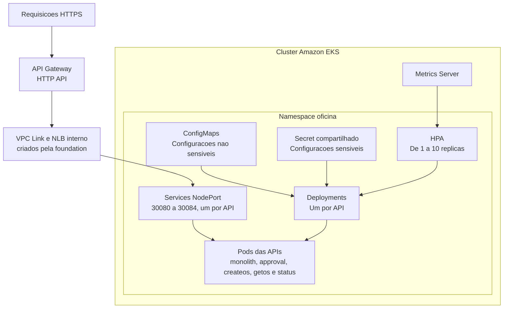

# Kubernetes - Estrutura e Implementação

## 1. Objetivo
Este documento descreve a estrutura desta pasta (`k8s/`), com os manifests das APIs para deploy no EKS criado por este repositório. Os manifests são separados por feature (API) e por tipo de recurso (kind), e são aplicados com Kustomize ([kustomization.yaml](kustomization.yaml)).

Os manifests foram derivados originalmente do docker-compose da aplicação. O código, o build das imagens e o push para o ECR ficam no repositório [APP](https://github.com/GuiToniello/tech-challenge-fase-3-APP-soat16-rm374658). O banco de dados (Amazon RDS) fica no repositório [DB](https://github.com/GuiToniello/tech-challenge-fase-3-DB-soat16-rm374658). Visão geral do repositório: [README principal](../README.md).

## 2. Estrutura adotada
Foi adotado o padrão folder-by-feature, com uma pasta por serviço.

Estrutura:
- [kustomization.yaml](kustomization.yaml): lista os recursos, define o namespace `oficina` e gera o Secret das APIs.
- [.env.example](.env.example): template do `k8s/.env` usado pelo `secretGenerator` (seção 5).
- [base/namespace.yml](base/namespace.yml)
- [features/monolith-api](features/monolith-api)
- [features/approval-api](features/approval-api)
- [features/createos-api](features/createos-api)
- [features/getos-api](features/getos-api)
- [features/status-api](features/status-api)

Cada pasta de API contém:
- configmap.yml
- deployment.yml
- service.yml
- hpa.yml

### 2.1 Arquitetura no cluster
- Cada API tem um Deployment. Ele começa com uma réplica e verifica a saúde em `/health`.
- Cada Deployment é exposto por um Service do tipo `NodePort`, com porta fixa (30080–30084). A porta só aceita tráfego de dentro da VPC, então o Service não fica exposto diretamente na Internet.
- O API Gateway recebe as requisições HTTPS e, pelo VPC Link e pelo NLB interno (criados pela foundation), entrega cada caminho no NodePort da API correspondente (seção 8).
- Os ConfigMaps guardam configurações não sensíveis. O Secret compartilhado guarda os dados sensíveis (conexão com o RDS e chave do Resend).
- Um HPA acompanha CPU e memória e ajusta cada Deployment entre 1 e 10 réplicas, com base nas métricas do Metrics Server.



## 3. Ordem de aplicação
Pré-requisitos, nesta ordem:
1. Cluster, API Gateway e addons: workflow **Bootstrap** deste repositório (foundation → addons). O API Gateway, o VPC Link e o NLB são criados pela foundation. O Metrics Server é instalado pelo Terraform via Helm, em `infra/addons`.
2. RDS: **Bootstrap** do repositório [DB](https://github.com/GuiToniello/tech-challenge-fase-3-DB-soat16-rm374658).
3. Imagens no ECR: publicadas pelo repositório [APP](https://github.com/GuiToniello/tech-challenge-fase-3-APP-soat16-rm374658).

A aplicação é feita pelo CI:
- Workflow **K8s Apply** ([k8s-apply.yml](../.github/workflows/k8s-apply.yml), disparado pelo repo APP depois de cada push de imagens, ou manual): descobre o endpoint do RDS, gera o `k8s/.env`, roda `kubectl apply -k k8s` e, com o input `restart-pods` (padrão `true`), faz o rollout restart das 5 APIs.
- Workflow **Deploy**, em push na `main` com mudança em `k8s/**`: roda o mesmo apply, com rollout restart das 5 APIs.

Apply só a partir da `main`. Detalhes em [.github/workflows/README.md](../.github/workflows/README.md).

Para aplicar manualmente, a partir da raiz do repositório e com o `k8s/.env` preenchido (seção 5):
- `kubectl apply -k k8s`

Não use `kubectl apply -f` por pasta: o Secret `oficina-api-secrets` só é gerado pelo Kustomize.

Comandos para verificação:
- `kubectl get pods,svc,hpa -n oficina`

Opcional: para acessar uma API via localhost sem passar pelo API Gateway, encaminhe a porta do Service:
- `kubectl port-forward -n oficina service/monolith-api 8080:80` (depois, `http://localhost:8080/health`)

## 4. Recursos criados por API
Para cada API foram criados os seguintes recursos:
1. ConfigMap `<api>-config` com configurações não sensíveis (`ASPNETCORE_ENVIRONMENT=Production`, `ASPNETCORE_URLS=http://+:8080`, logging).
2. Secret comum `oficina-api-secrets`, gerado pelo Kustomize a partir do `k8s/.env` (seção 5).
3. Deployment com 1 réplica inicial, porta 8080, probes (startup, liveness e readiness) em `/health` e recursos de 100m/128Mi (requests) e 500m/512Mi (limits).
4. Service do tipo NodePort (porta 80 → 8080, com `nodePort` fixo; tabela na seção 8).
5. HPA (autoscaling/v2).
6. Pull das imagens privadas no ECR usando a role IAM dos nodes do EKS.

### 4.1 APIs contempladas
- monolith-api
- approval-api
- createos-api
- getos-api
- status-api

### 4.2 Imagens utilizadas
As imagens são construídas e publicadas no ECR pelo repositório [APP](https://github.com/GuiToniello/tech-challenge-fase-3-APP-soat16-rm374658). Os Deployments usam a tag `latest` com `imagePullPolicy: Always`:
- 903936907231.dkr.ecr.us-east-1.amazonaws.com/techchallenge-oficina-monolith:latest
- 903936907231.dkr.ecr.us-east-1.amazonaws.com/techchallenge-oficina-approval:latest
- 903936907231.dkr.ecr.us-east-1.amazonaws.com/techchallenge-oficina-createos:latest
- 903936907231.dkr.ecr.us-east-1.amazonaws.com/techchallenge-oficina-getos:latest
- 903936907231.dkr.ecr.us-east-1.amazonaws.com/techchallenge-oficina-status:latest

Como a tag não muda, uma imagem nova no ECR não altera os manifests: os pods só a puxam depois de um rollout restart, feito pelo K8s Apply com `restart-pods = true`. O repo APP dispara esse K8s Apply automaticamente depois de cada push de imagens.

### 4.3 Autenticação no ECR privado
A role IAM dos nodes tem a policy gerenciada `AmazonEC2ContainerRegistryReadOnly` ([infra/foundation/iam.tf](../infra/foundation/iam.tf)), permitindo que o kubelet faça pull das imagens privadas do ECR sem Secret Kubernetes.

A mesma região AWS facilita o acesso ao registry, mas não substitui a permissão IAM nem a conectividade de rede. Os nodes ficam nas subnets públicas, com IP público, e acessam o ECR pela internet (não há NAT).

## 5. Secret das APIs
O [kustomization.yaml](kustomization.yaml) gera o Secret `oficina-api-secrets` a partir do `k8s/.env`, com as chaves de [.env.example](.env.example):
- `DatabaseSettings__ConnectionString`: aponta para o RDS do repositório [DB](https://github.com/GuiToniello/tech-challenge-fase-3-DB-soat16-rm374658).
- `ResendSettings__ApiKey`: chave de envio de email (Resend).

No CI, o K8s Apply gera o `k8s/.env`:
- Descobre o endpoint pelo identifier do RDS (variable `RDS_INSTANCE_IDENTIFIER`, `techchallenge-oficina-postgres`).
- Monta a connection string com as variables `RDS_DATABASE` e `RDS_USERNAME` e o secret `RDS_PASSWORD`, que precisa ter o mesmo valor do repositório DB.
- Usa o secret `RESEND_API_KEY` para `ResendSettings__ApiKey`.

O `k8s/.env` é ignorado pelo Git e nunca deve ser versionado; apenas o `.env.example` é versionado.

Como o `kustomization.yaml` usa `disableNameSuffixHash: true`, o nome do Secret não muda quando o conteúdo muda, e os Deployments não reiniciam sozinhos. O mesmo vale para os ConfigMaps: eles são lidos via `envFrom` e não têm hash no nome. Por isso, o apply de push em `k8s/**` sempre faz o rollout restart. Depois de trocar um valor fora do Git, como a senha do RDS ou a chave do Resend, rode o K8s Apply com `restart-pods = true`.

## 6. Regras de HPA aplicadas
Foi seguido o requisito informado:
1. CPU alvo: 30% de utilização.
2. Memória alvo: 80% de utilização.
3. Mínimo: 1 réplica.
4. Máximo: 10 réplicas.

As métricas vêm do Metrics Server, instalado pelo `infra/addons`.

Aplicado em:
- [features/monolith-api/hpa.yml](features/monolith-api/hpa.yml)
- [features/approval-api/hpa.yml](features/approval-api/hpa.yml)
- [features/createos-api/hpa.yml](features/createos-api/hpa.yml)
- [features/getos-api/hpa.yml](features/getos-api/hpa.yml)
- [features/status-api/hpa.yml](features/status-api/hpa.yml)

## 7. Namespace
Todos os recursos ficam no namespace `oficina`, definido em [base/namespace.yml](base/namespace.yml) e forçado pelo `namespace` do [kustomization.yaml](kustomization.yaml).

## 8. Acesso externo (API Gateway)
O acesso de fora do cluster é feito pelo Amazon API Gateway (HTTP API `techchallenge-oficina-api`), criado pelo Terraform da foundation ([api-gateway.tf](../infra/foundation/api-gateway.tf) e [nlb.tf](../infra/foundation/nlb.tf)). Não há Ingress nem Ingress Controller.

Caminho de uma requisição: API Gateway → VPC Link → NLB interno → NodePort em qualquer node → Service → pod.

Configuração aplicada:
1. Uma rota `ANY /<api>/{proxy+}` por API, no stage `$default`.
2. A integração remove o prefixo antes de encaminhar ao backend (`overwrite:path`): `/monolith/api/clientes` chega à API como `/api/clientes`.
3. O header `Authorization` é repassado, e o JWT continua sendo validado pelas APIs. O gateway não tem authorizer.
4. Cada API tem um listener e um target group no NLB, na mesma porta do NodePort. As portas ficam em `local.api_node_ports` ([infra/foundation/locals.tf](../infra/foundation/locals.tf)) e **precisam ser iguais** ao `nodePort` dos `service.yml`.

| API | Rota | NodePort |
|---|---|---|
| monolith-api | `https://<id>.execute-api.us-east-1.amazonaws.com/monolith/...` | 30080 |
| approval-api | `https://<id>.execute-api.us-east-1.amazonaws.com/approval/...` | 30081 |
| createos-api | `https://<id>.execute-api.us-east-1.amazonaws.com/createos/...` | 30082 |
| getos-api | `https://<id>.execute-api.us-east-1.amazonaws.com/getos/...` | 30083 |
| status-api | `https://<id>.execute-api.us-east-1.amazonaws.com/status/...` | 30084 |

O endpoint só atende HTTPS. Um prefixo sozinho (`/monolith` ou `/monolith/`) responde 404, porque não casa com `{proxy+}`. O Swagger UI de cada API busca `/swagger/v1/swagger.json` pela raiz, então não abre atrás do prefixo, mas `/<api>/swagger/v1/swagger.json` funciona.

Checklist de confirmação, com o ambiente criado:
1. URL da API: output `api_gateway_endpoint` da foundation, ou `aws apigatewayv2 get-apis --query "Items[?Name=='techchallenge-oficina-api'].ApiEndpoint" --output text`.
2. Health de cada API: `curl.exe -i "<endpoint>/monolith/health"` (e `/approval`, `/createos`, `/getos` e `/status`) → 200.
3. Autenticação passando pelo gateway: `curl.exe -i "<endpoint>/monolith/api/clientes"` → 401 sem token e 200 com o token do Auth0 (`Authorization: Bearer <token>`).
4. Target groups `techchallenge-oficina-<api>` `healthy` no console do EC2 (Target Groups).

## 9. Validação
Para validar os manifests sem acessar a AWS, a partir da raiz do repositório:

```powershell
Copy-Item k8s/.env.example k8s/.env
kubectl kustomize k8s
```

É a mesma verificação do check `validate-k8s` nos PRs. O `secretGenerator` exige o `k8s/.env`, então o template com placeholders basta. Também é possível usar `kubectl apply --dry-run=client --validate=false -k k8s`, mas ele consulta a API do cluster do contexto atual do kubeconfig.

O build deve gerar:
- Namespace `oficina`.
- ConfigMaps das APIs.
- Secret `oficina-api-secrets`, gerado a partir do `k8s/.env`.
- Deployments, Services (`NodePort`) e HPAs das cinco APIs.

## 10. Finalização
Antes de promover para ambientes compartilhados (qa/homolog/prod), recomenda-se:
1. Trocar a tag `latest` por tags versionadas publicadas pelo repositório APP, para ter deploys rastreáveis e rollback.
2. Manter a senha do RDS e a chave do Resend apenas nos secrets do GitHub (`RDS_PASSWORD`, `RESEND_API_KEY`).
3. Revisar requests/limits de CPU e memória conforme a carga real. O node group tem 2 nodes `t3.small` fixos (min/desired/max 2/2/2), então o HPA pode criar pods que ficam `Pending` por falta de capacidade.
4. Garantir que a foundation (API Gateway e NLB) e o `infra/addons` (Metrics Server) estejam aplicados antes do apply dos manifests.
