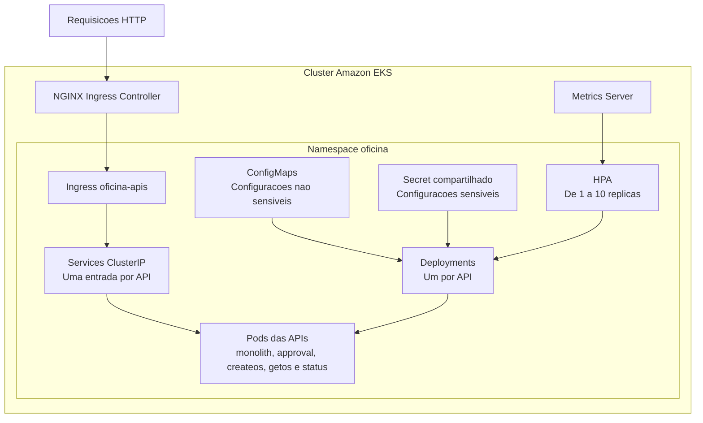

# Kubernetes - Estrutura e Implementação

## 1. Objetivo
Este documento descreve a estrutura desta pasta (`k8s/`), com os manifests das APIs para deploy no EKS criado por este repositório. Os manifests são separados por feature (API) e por tipo de recurso (kind), e são aplicados com Kustomize ([kustomization.yaml](kustomization.yaml)).

Os manifests foram derivados originalmente do docker-compose da aplicação. O código, o build das imagens e o push para o ECR ficam no repositório [APP](https://github.com/GuiToniello/tech-challenge-fase-3-APP-soat16-rm374658). O banco de dados (Amazon RDS) fica no repositório [DB](https://github.com/GuiToniello/tech-challenge-fase-3-DB-soat16-rm374658). Visão geral do repositório: [README principal](../README.md).

## 2. Estrutura adotada
Foi adotado o padrão folder-by-feature, com uma pasta por serviço.

Estrutura:
- [kustomization.yaml](kustomization.yaml): lista os recursos, define o namespace `oficina` e gera o Secret das APIs.
- [.env.example](.env.example): template do `k8s/.env` usado pelo `secretGenerator` (seção 5).
- [base/namespace.yml](base/namespace.yml)
- [infra/ingress.yml](infra/ingress.yml): contém só o Ingress. Não confundir com a pasta `infra/` da raiz, que é o Terraform.
- [features/monolith-api](features/monolith-api)
- [features/approval-api](features/approval-api)
- [features/createos-api](features/createos-api)
- [features/getos-api](features/getos-api)
- [features/status-api](features/status-api)

Cada pasta de API contém:
- configmap.yml
- deployment.yml
- service.yml
- hpa.yml

### 2.1 Arquitetura no cluster
- Cada API tem um Deployment. Ele começa com uma réplica e verifica a saúde em `/health`.
- Cada Deployment é acessado internamente por um Service do tipo `ClusterIP`, que não fica exposto diretamente na Internet.
- O Ingress recebe as requisições HTTP e direciona cada caminho para o Service da API correspondente.
- Os ConfigMaps guardam configurações não sensíveis. O Secret compartilhado guarda os dados sensíveis (conexão com o RDS e chave do Resend).
- Um HPA acompanha CPU e memória e ajusta cada Deployment entre 1 e 10 réplicas, com base nas métricas do Metrics Server.



## 3. Ordem de aplicação
Pré-requisitos, nesta ordem:
1. Cluster e addons: workflow **Bootstrap** deste repositório (foundation → addons). O Ingress Controller e o Metrics Server são instalados pelo Terraform via Helm, em `infra/addons`.
2. RDS: **Bootstrap** do repositório [DB](https://github.com/GuiToniello/tech-challenge-fase-3-DB-soat16-rm374658).
3. Imagens no ECR: publicadas pelo repositório [APP](https://github.com/GuiToniello/tech-challenge-fase-3-APP-soat16-rm374658).

A aplicação é feita pelo CI:
- Workflow **K8s Apply** ([k8s-apply.yml](../.github/workflows/k8s-apply.yml), manual): descobre o endpoint do RDS, gera o `k8s/.env`, roda `kubectl apply -k k8s` e, com o input `restart-pods` (padrão `true`), faz o rollout restart das 5 APIs.
- Workflow **Deploy**, em push na `main` com mudança em `k8s/**`: roda o mesmo apply, **sem** restart dos pods.

Apply só a partir da `main`. Detalhes em [.github/workflows/README.md](../.github/workflows/README.md).

Para aplicar manualmente, a partir da raiz do repositório e com o `k8s/.env` preenchido (seção 5):
- `kubectl apply -k k8s`

Não use `kubectl apply -f` por pasta: o Secret `oficina-api-secrets` só é gerado pelo Kustomize.

Comandos para verificação:
- `kubectl get pods,svc,hpa,ingress -n oficina`
- `kubectl get ingressclass`
- `kubectl get pods,svc -n ingress-nginx`

Opcional (ambiente local): para acessar via localhost, encaminhe as portas do ingress controller:
- `kubectl port-forward -n ingress-nginx service/ingress-nginx-controller 80:80 443:443`

## 4. Recursos criados por API
Para cada API foram criados os seguintes recursos:
1. ConfigMap `<api>-config` com configurações não sensíveis (`ASPNETCORE_ENVIRONMENT=Production`, `ASPNETCORE_URLS=http://+:8080`, logging).
2. Secret comum `oficina-api-secrets`, gerado pelo Kustomize a partir do `k8s/.env` (seção 5).
3. Deployment com 1 réplica inicial, porta 8080, probes (startup, liveness e readiness) em `/health` e recursos de 100m/128Mi (requests) e 500m/512Mi (limits).
4. Service do tipo ClusterIP (porta 80 → 8080).
5. HPA (autoscaling/v2).
6. Pull das imagens privadas no ECR usando a role IAM dos nodes do EKS.

### 4.1 APIs contempladas
- monolith-api
- approval-api
- createos-api
- getos-api
- status-api

### 4.2 Imagens utilizadas
As imagens são construídas e publicadas no ECR pelo repositório [APP](https://github.com/GuiToniello/tech-challenge-fase-3-APP-soat16-rm374658). Os Deployments usam a tag `latest` com `imagePullPolicy: Always`:
- 903936907231.dkr.ecr.us-east-1.amazonaws.com/techchallenge-oficina-monolith:latest
- 903936907231.dkr.ecr.us-east-1.amazonaws.com/techchallenge-oficina-approval:latest
- 903936907231.dkr.ecr.us-east-1.amazonaws.com/techchallenge-oficina-createos:latest
- 903936907231.dkr.ecr.us-east-1.amazonaws.com/techchallenge-oficina-getos:latest
- 903936907231.dkr.ecr.us-east-1.amazonaws.com/techchallenge-oficina-status:latest

Como a tag não muda, uma imagem nova no ECR não altera os manifests: os pods só a puxam depois de um rollout restart (K8s Apply com `restart-pods = true`).

### 4.3 Autenticação no ECR privado
A role IAM dos nodes tem a policy gerenciada `AmazonEC2ContainerRegistryReadOnly` ([infra/foundation/iam.tf](../infra/foundation/iam.tf)), permitindo que o kubelet faça pull das imagens privadas do ECR sem Secret Kubernetes.

A mesma região AWS facilita o acesso ao registry, mas não substitui a permissão IAM nem a conectividade de rede. Os nodes ficam nas subnets públicas, com IP público, e acessam o ECR pela internet (não há NAT).

## 5. Secret das APIs
O [kustomization.yaml](kustomization.yaml) gera o Secret `oficina-api-secrets` a partir do `k8s/.env`, com as chaves de [.env.example](.env.example):
- `DatabaseSettings__ConnectionString`: aponta para o RDS do repositório [DB](https://github.com/GuiToniello/tech-challenge-fase-3-DB-soat16-rm374658).
- `ResendSettings__ApiKey`: chave de envio de email (Resend).

No CI, o K8s Apply gera o `k8s/.env`:
- Descobre o endpoint pelo identifier do RDS (variable `RDS_INSTANCE_IDENTIFIER`, `techchallenge-oficina-postgres`).
- Monta a connection string com as variables `RDS_DATABASE` e `RDS_USERNAME` e o secret `RDS_PASSWORD`, que precisa ter o mesmo valor do repositório DB.
- Usa o secret `RESEND_API_KEY` para `ResendSettings__ApiKey`.

O `k8s/.env` é ignorado pelo Git e nunca deve ser versionado; apenas o `.env.example` é versionado.

Como o `kustomization.yaml` usa `disableNameSuffixHash: true`, o nome do Secret não muda quando o conteúdo muda, e os Deployments não reiniciam sozinhos. O mesmo vale para os ConfigMaps: eles são lidos via `envFrom` e não têm hash no nome. Depois de trocar um valor, rode o K8s Apply com `restart-pods = true`. Isso vale para a senha do RDS e também para um ConfigMap alterado em PR, cujo Deploy no push aplica sem restart.

## 6. Regras de HPA aplicadas
Foi seguido o requisito informado:
1. CPU alvo: 30% de utilização.
2. Memória alvo: 80% de utilização.
3. Mínimo: 1 réplica.
4. Máximo: 10 réplicas.

As métricas vêm do Metrics Server, instalado pelo `infra/addons`.

Aplicado em:
- [features/monolith-api/hpa.yml](features/monolith-api/hpa.yml)
- [features/approval-api/hpa.yml](features/approval-api/hpa.yml)
- [features/createos-api/hpa.yml](features/createos-api/hpa.yml)
- [features/getos-api/hpa.yml](features/getos-api/hpa.yml)
- [features/status-api/hpa.yml](features/status-api/hpa.yml)

## 7. Namespace
Todos os recursos ficam no namespace `oficina`, definido em [base/namespace.yml](base/namespace.yml) e forçado pelo `namespace` do [kustomization.yaml](kustomization.yaml).

## 8. Ingress e acesso externo
O Ingress `oficina-apis` expõe as APIs via HTTP fora do cluster:
- [infra/ingress.yml](infra/ingress.yml)

Configuração aplicada:
1. Sem campo `host`, permitindo o hostname DNS público gerado pela AWS.
2. Roteamento por path (regex) para cada API.
3. Reescrita de URL para remover o prefixo antes de encaminhar ao backend.
4. Backends apontando para os Services ClusterIP na porta 80.
5. `ingressClassName: nginx`, que referencia o controller ingress-nginx instalado pelo Terraform via Helm (`infra/addons`). O Load Balancer do controller fica nas subnets públicas (tag `kubernetes.io/role/elb`).

Rotas disponíveis:
1. http://<hostname-do-load-balancer>/monolith
2. http://<hostname-do-load-balancer>/approval
3. http://<hostname-do-load-balancer>/createos
4. http://<hostname-do-load-balancer>/getos
5. http://<hostname-do-load-balancer>/status

Checklist de confirmação do controller:
1. Validar classe: `kubectl get ingressclass`.
2. Validar pods do controller: `kubectl get pods -n ingress-nginx`.
3. Validar service de entrada: `kubectl get svc -n ingress-nginx`.

O hostname do Load Balancer aparece na coluna `EXTERNAL-IP` de `kubectl get svc -n ingress-nginx`.

## 9. Validação
Para validar os manifests sem acessar a AWS, a partir da raiz do repositório:

```powershell
Copy-Item k8s/.env.example k8s/.env
kubectl kustomize k8s
```

É a mesma verificação do check `validate-k8s` nos PRs. O `secretGenerator` exige o `k8s/.env`, então o template com placeholders basta. Também é possível usar `kubectl apply --dry-run=client --validate=false -k k8s`, mas ele consulta a API do cluster do contexto atual do kubeconfig.

O build deve gerar:
- Namespace `oficina`.
- ConfigMaps das APIs.
- Secret `oficina-api-secrets`, gerado a partir do `k8s/.env`.
- Deployments, Services e HPAs das cinco APIs.
- Ingress das APIs.

## 10. Finalização
Antes de promover para ambientes compartilhados (qa/homolog/prod), recomenda-se:
1. Trocar a tag `latest` por tags versionadas publicadas pelo repositório APP, para ter deploys rastreáveis e rollback.
2. Manter a senha do RDS e a chave do Resend apenas nos secrets do GitHub (`RDS_PASSWORD`, `RESEND_API_KEY`).
3. Revisar requests/limits de CPU e memória conforme a carga real. O node group tem 2 nodes `t3.small` fixos (min/desired/max 2/2/2), então o HPA pode criar pods que ficam `Pending` por falta de capacidade.
4. Garantir que o `infra/addons` esteja aplicado (Ingress Controller e Metrics Server) antes do apply dos manifests.
5. Se for necessário expor portas distintas por API (ex.: localhost:7194), usar estratégia alternativa (NodePort/LoadBalancer ou configuração TCP do controller), pois o Ingress HTTP padrão expõe em 80/443.
